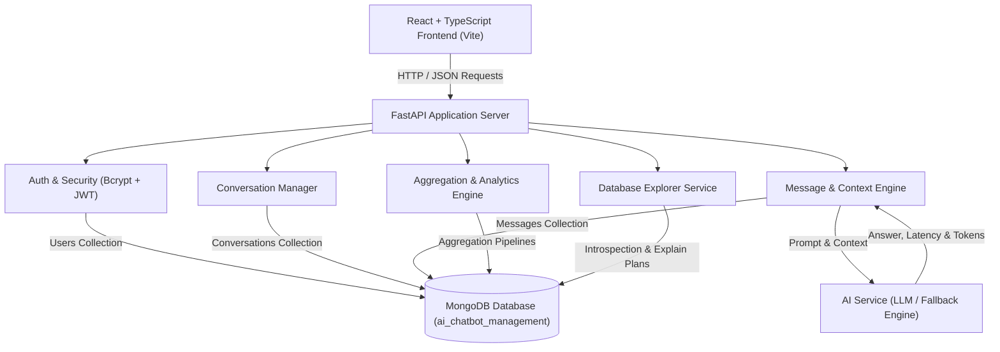
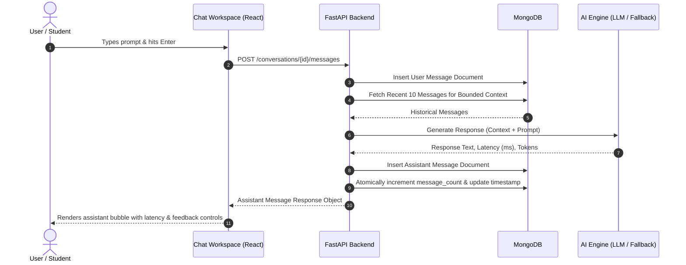

# System Architecture

## Architectural Diagram

```mermaid
graph TD
    Client["React + TypeScript Frontend (Vite)"]
    API["FastAPI Application Server"]
    AuthModule["Auth & Security (Bcrypt + JWT)"]
    ConvModule["Conversation Manager"]
    MsgModule["Message & Context Engine"]
    AIEngine["AI Service (LLM / Fallback Engine)"]
    AnalyticsModule["Aggregation & Analytics Engine"]
    DBExplorer["Database Explorer Service"]
    MongoDB[("MongoDB Database (ai_chatbot_management)")]

    Client -->|HTTP / JSON Requests| API
    API --> AuthModule
    API --> ConvModule
    API --> MsgModule
    API --> AnalyticsModule
    API --> DBExplorer

    MsgModule -->|Prompt & Context| AIEngine
    AIEngine -->|Answer, Latency & Tokens| MsgModule

    AuthModule -->|Users Collection| MongoDB
    ConvModule -->|Conversations Collection| MongoDB
    MsgModule -->|Messages Collection| MongoDB
    AnalyticsModule -->|Aggregation Pipelines| MongoDB
    DBExplorer -->|Introspection & Explain Plans| MongoDB
```

## Data Flow Diagram: Message Lifecycle

```mermaid
sequenceDiagram
    autonumber
    actor User as User / Student
    participant UI as Chat Workspace (React)
    participant API as FastAPI Backend
    participant DB as MongoDB
    participant AI as AI Engine (LLM / Fallback)

    User->>UI: Types prompt & hits Enter
    UI->>API: POST /conversations/{id}/messages
    API->>DB: Insert User Message Document
    API->>DB: Fetch Recent 10 Messages for Bounded Context
    DB-->>API: Historical Messages
    API->>AI: Generate Response (Context + Prompt)
    AI-->>API: Response Text, Latency (ms), Tokens
    API->>DB: Insert Assistant Message Document
    API->>DB: Atomically increment message_count & update timestamp
    API-->>UI: Assistant Message Response Object
    UI-->>User: Renders assistant bubble with latency & feedback controls
```
