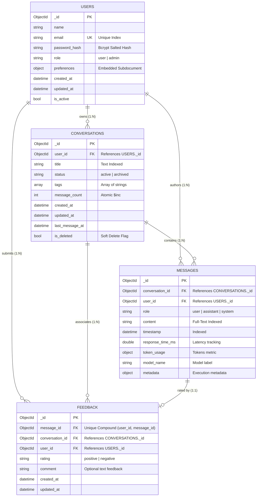

# Entity-Relationship & Document Modeling (ER Diagram)

## MongoDB Document Data Model

```mermaid
erDiagram
    USERS ||--o{ CONVERSATIONS : "owns (1:N)"
    USERS ||--o{ MESSAGES : "authors (1:N)"
    USERS ||--o{ FEEDBACK : "submits (1:N)"
    CONVERSATIONS ||--o{ MESSAGES : "contains (1:N)"
    CONVERSATIONS ||--o{ FEEDBACK : "associates (1:N)"
    MESSAGES ||--o| FEEDBACK : "rated by (1:1)"

    USERS {
        ObjectId _id PK
        string name
        string email UK "Unique Index"
        string password_hash "Bcrypt Salted Hash"
        string role "user | admin"
        object preferences "Embedded Subdocument"
        datetime created_at
        datetime updated_at
        bool is_active
    }

    CONVERSATIONS {
        ObjectId _id PK
        ObjectId user_id FK "References USERS._id"
        string title "Text Indexed"
        string status "active | archived"
        array tags "Array of strings"
        int message_count "Atomic $inc"
        datetime created_at
        datetime updated_at
        datetime last_message_at
        bool is_deleted "Soft Delete Flag"
    }

    MESSAGES {
        ObjectId _id PK
        ObjectId conversation_id FK "References CONVERSATIONS._id"
        ObjectId user_id FK "References USERS._id"
        string role "user | assistant | system"
        string content "Full-Text Indexed"
        datetime timestamp "Indexed"
        double response_time_ms "Latency tracking"
        object token_usage "Tokens metric"
        string model_name "Model label"
        object metadata "Execution metadata"
    }

    FEEDBACK {
        ObjectId _id PK
        ObjectId message_id FK "Unique Compound (user_id, message_id)"
        ObjectId conversation_id FK "References CONVERSATIONS._id"
        ObjectId user_id FK "References USERS._id"
        string rating "positive | negative"
        string comment "Optional text feedback"
        datetime created_at
        datetime updated_at
    }
```
